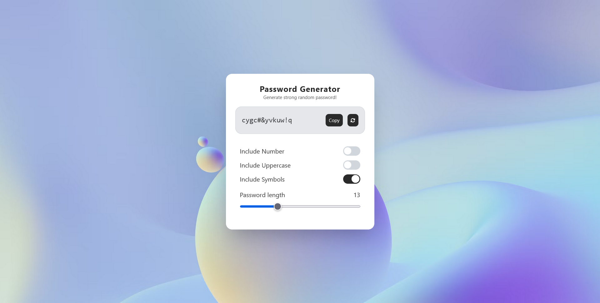

# 🔐 Password Generator

A sleek and minimal **Password Generator** web application built using **Vite**, **React**, and **Tailwind CSS**. This tool allows users to generate strong, secure passwords with custom options such as including numbers, uppercase letters, symbols, and adjustable length.



## ✨ Features

-   🔁 One-click strong password generation
-   🔢 Option to include numbers
-   🔠 Option to include uppercase characters
-   🔣 Option to include symbols
-   📏 Adjustable password length using a slider
-   📋 Copy-to-clipboard functionality
-   💡 Responsive and accessible UI with modern design

## 🛠 Tech Stack

-   ⚡️ [Vite](https://vitejs.dev/) – blazing fast development environment
-   ⚛️ [React](https://react.dev/) – component-based UI
-   🎨 [Tailwind CSS](https://tailwindcss.com/) – utility-first styling

## 🚀 Getting Started

Clone the repository and install dependencies:

```bash
git clone https://github.com/your-username/password-generator.git
cd password-generator
npm install
```

Start the development server:

```bash
npm run dev
```

Build for production:

```bash
npm run build
```

Preview production build:

```bash
npm run preview
```
